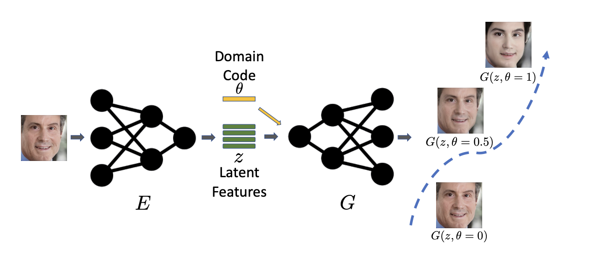
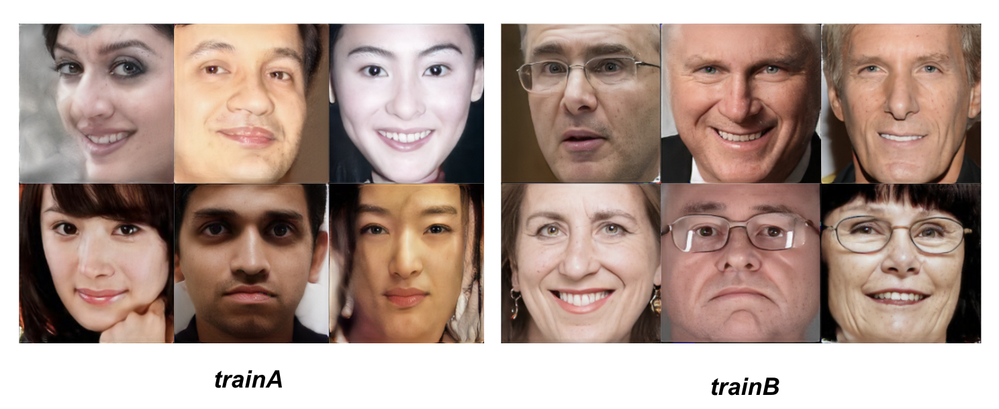

# Santa: Unpaired Image-to-Image Translation With Shortest Path Regularization ([CVPR2023](https://openaccess.thecvf.com/content/CVPR2023/papers/Xie_Unpaired_Image-to-Image_Translation_With_Shortest_Path_Regularization_CVPR_2023_paper.pdf))

### Abstract
Unpaired image-to-image translation aims to learn
proper mappings that can map images from one domain to
another domain while preserving the content of the input
image. However, with large enough capacities, the network
can learn to map the inputs to any random permutation of
images in another domain. Existing methods treat two domains as discrete and propose different assumptions to address this problem. In this paper, we start from a different
perspective and consider the paths connecting the two domains. We assume that the optimal path length between
the input and output image should be the shortest among
all possible paths. Based on this assumption, we propose a
new method to allow generating images along the path and
present a simple way to encourage the network to find the
shortest path without pair information. Extensive experiments on various tasks demonstrate the superiority of our
approach.



### Basic Usage

- Training:
```bash
python train.py --dataroot=datasets/cityscapes --direction=BtoA --lambda_path=0.1 --tag=santa 
```
- Test:
put the trained checkpoints to the folder ```checkpoints/cityscapes```
```bash
python test.py --dataroot=datasets/cityscapes --name=cityscapes --direction=BtoA
```
- Hyper-parameters
The default hyper-parameters should lead to good results. If you want better performance, try play with
```--lambda_path```, ```--path_layers```, ```--path_interval_min``` and ```--path_interval_max```.     

### Pretrained Models
- [cat2dog](https://drive.google.com/file/d/1S0K4uEs6C17uJKFXjBJ5_STGuzTvmDnk/view?usp=sharing)
- [old2young](https://drive.google.com/file/d/18nlYAaMnqznNEWHVzjLSY_g-WZBVvAqc/view?usp=sharing)
- [winter2summer](https://drive.google.com/file/d/121cghssDMPzmMNK7ROtejhNzFxERw8O4/view?usp=sharing)
- [cityscapes](https://drive.google.com/file/d/1g2ygEJ4NIHqL6RnAahLtGdA92Q3IyuDa/view?usp=sharing)

### Dataset 
The dataset is constructed from the [UTKFace dataset](https://susanqq.github.io/UTKFace/). Then I apply super-resolution model and divide the output images into old/young according to the age.
The dataset contains 1500 training and 500 testing images for each domain.
- [old2young](https://drive.google.com/file/d/1VDKItJsUQ91TMbWEEuyRvoNBAxT8iRyC/view?usp=sharing)

Following shows the first six training images in each domain.




## Citation
If you use this code for your research, please consider citing our [paper](https://openaccess.thecvf.com/content/CVPR2023/papers/Xie_Unpaired_Image-to-Image_Translation_With_Shortest_Path_Regularization_CVPR_2023_paper.pdf):

```
@inproceedings{xie2023unpaired,
  title={Unpaired Image-to-Image Translation With Shortest Path Regularization},
  author={Xie, Shaoan and Xu, Yanwu and Gong, Mingming and Zhang, Kun},
  booktitle={Proceedings of the IEEE/CVF Conference on Computer Vision and Pattern Recognition},
  pages={10177--10187},
  year={2023}
}
```